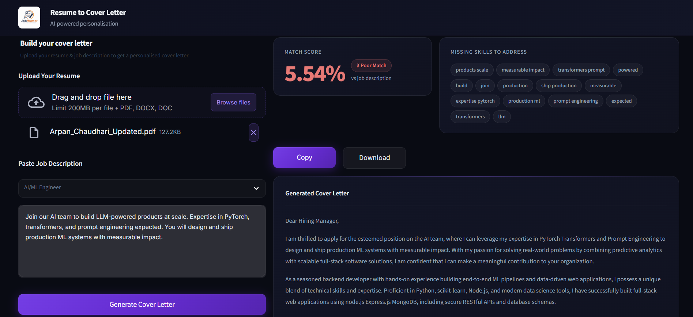

# JobHunter: AI-Powered Cover Letter Maker


JobHunter is a premium, beautifully designed Streamlit application that generates highly personalized cover letters by analyzing your resume against a specific job description. It uses Machine Learning to score your resume and leverages local, privacy-preserving AI (via Ollama) to write the perfect cover letter.

## Features

- **ML-Powered Matching:** Calculates an exact Match Score between your resume and the job description using TF-IDF and Cosine Similarity.
- **Skill Gap Analysis:** Automatically extracts and identifies critical missing skills from the job description so the AI can address them gracefully.
- **Local AI Generation:** Integrates with local LLMs (powered by Ollama) to craft highly personalized cover letters 100% locally—keeping your private data completely secure.
- **Premium UI:** A highly polished, responsive, dark-mode interface built with custom CSS, avoiding the "standard" Streamlit look.
- **Native PDF Parsing:** Accurately extracts and cleans text directly from your uploaded PDF or Word resumes.

## Tech Stack

- **Frontend:** Streamlit, Custom CSS
- **Machine Learning:** Scikit-learn (`TfidfVectorizer`, `cosine_similarity`)
- **Natural Language Processing:** NLTK, pdfplumber
- **Generative AI:** Ollama (Local Llama 3 models)

## Installation & Setup

**1. Clone the repository**
```bash
git clone https://github.com/yourusername/job-hunter.git
cd job-hunter
```

**2. Create a virtual environment**
```bash
python -m venv venv
# On Windows
venv\Scripts\activate
# On macOS/Linux
source venv/bin/activate
```

**3. Install dependencies**
```bash
pip install -r requirements.txt
```

**4. Set up Local AI (Ollama)**
- Download and install [Ollama](https://ollama.com/).
- Open your terminal and pull the model we use:
```bash
ollama run llama3.2:3b
```
*(Leave Ollama running in the background while using the app).*

**5. Run the Application**
```bash
streamlit run app.py
```

## Screenshots


## Contributing
Contributions, issues, and feature requests are welcome! Feel free to check the issues page.

## License
This project is licensed under the MIT License.
